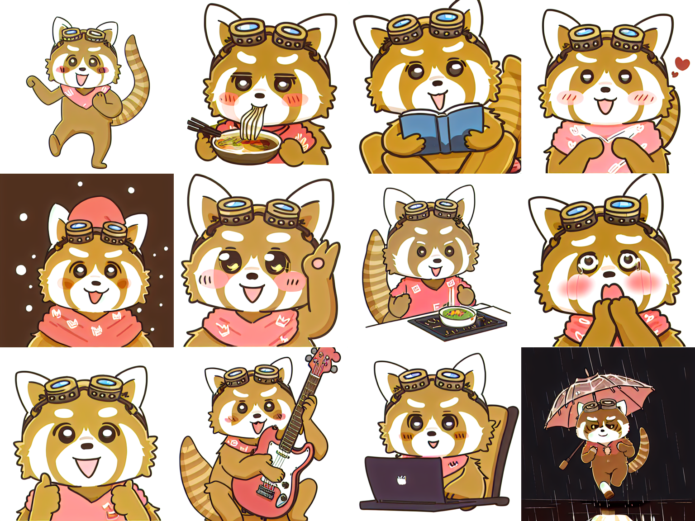

# 🐾 Masafee LoRA

> 自作キャラクターを、消費者向けGPU 1台でAIに学習させる — LoRA ファインチューニング実験

個人制作のオリジナルキャラクター「マサフィー」（LINEスタンプのレッサーパンダ）を、Stable Diffusion の LoRA ファインチューニングで再現し、新しいポーズ・場面のイラストを生成できるようにした実験プロジェクトです。学習はクラウドの有料計算資源を使わず、**自宅の NVIDIA GeForce RTX 3060 1台**のみで完結させました。実験の手順・比較・知見は論文（日英 / Markdown・PDF）にまとめています。

    [](https://huggingface.co/masafy/masafee-lora) [](https://doi.org/10.5281/zenodo.20397946) [](https://orcid.org/0009-0000-7977-2756)

🔗 **[キャラクター「マサフィー」LINEスタンプ](https://store.line.me/stickershop/product/19794926/ja)** · 🤗 **[Hugging Face で学習済みLoRAを配布中](https://huggingface.co/masafy/masafee-lora)**

---

## 📸 スクリーンショット

最良モデルで生成した、学習データに無い12種の新規ポーズ：



---

## ✨ 特徴

- **消費者向けGPUのみで完結** — RTX 3060（VRAM 12GB）1台。有料クラウド不要。1回の学習は9〜40分。
- **少数データ学習** — オリジナルキャラのLINEスタンプ16点から13点を選定して学習。
- **条件スイープ実験** — ベースモデル・学習率・LoRA次元を変えた6条件を自動学習・比較。
- **エポック数アブレーション** — 10〜60エポックを実測し、過学習が始まる点を特定。
- **知見の論文化** — 手順・比較・結論を学術論文形式（2カラム）でまとめ、日英・Markdown/PDF で同梱。
- **再現可能** — 学習スクリプト・プロンプト・最良LoRA・全比較画像を公開。

---

## 🛠️ 技術スタック

| カテゴリ | 技術 |
|---|---|
| 画像生成モデル | Stable Diffusion 1.5 / Counterfeit-V3.0 |
| 学習手法 | LoRA (Low-Rank Adaptation) |
| 学習フレームワーク | kohya-ss/sd-scripts |
| 基盤 | PyTorch 2.5.1 + CUDA 12.4 |
| Python環境 | Python 3.11（`uv` で構築） |
| ハードウェア | NVIDIA GeForce RTX 3060 12GB / Ubuntu 26.04 |

---

## 📁 ディレクトリ構成

```
masafee-lora/
├── paper/                  論文（日英 × Markdown / LaTeX / PDF）
│   ├── paper_ja.pdf         日本語版（2カラム）
│   ├── paper_en.pdf         英語版（2カラム）
│   └── figures/             論文用の図
├── scripts/                学習・生成スクリプト
│   ├── train.sh             初回学習
│   ├── run_sweep.sh         6条件スイープ学習
│   ├── run_ext60.sh         エポック延長アブレーション
│   ├── make_grids.py        比較グリッド生成
│   └── prompts/             生成プロンプト集
├── monitoring/             GPU PC リソース監視ダッシュボード（おまけ）
├── training_data/          学習に用いた13枚
├── model/                  最良 LoRA（cf_lr1_d32, epoch30）
└── results/                生成結果・比較画像
    ├── first_run/           初回学習の生成テスト
    ├── sweep_comparison/    6条件スイープ + エポック延長の比較グリッド
    └── showcase/            最良モデルによる新規ポーズ生成
```

---

## 🚀 セットアップ

```bash
# 1. 学習ツール (kohya-ss/sd-scripts) を取得
git clone https://github.com/kohya-ss/sd-scripts.git

# 2. Python 3.11 環境を用意（uv 推奨。ディストリ標準が新しすぎる場合に有効）
uv venv --python 3.11 venv
source venv/bin/activate

# 3. 依存をインストール
uv pip install torch==2.5.1 torchvision==0.20.1 --index-url https://download.pytorch.org/whl/cu124
uv pip install -r sd-scripts/requirements.txt

# 4. ベースモデルを配置（SD1.5 / Counterfeit-V3.0 を別途ダウンロード）
#    train_data/<繰り返し数>_masafee/ に training_data の画像とキャプションを配置

# 5. 学習を実行
bash scripts/train.sh
```

学習済みの最良 LoRA は `model/masafee_lora_best.safetensors` に同梱しています。Counterfeit-V3.0 をベースに `--network_mul 0.8` 程度で適用してください。

---

## 📄 論文

実験の詳細・比較・知見は論文にまとめています。

- **日本語版:** [paper/paper_ja.pdf](paper/paper_ja.pdf)
- **English:** [paper/paper_en.pdf](paper/paper_en.pdf)

主な知見：(1) 出力品質はベースモデルの選択に最も強く依存する、(2) 学習エポック数は約30で頭打ちになり、それ以上は過学習に向かう、(3) 出力品質の上限は学習画像枚数で決まる。

---

## 📚 引用 / Citation

このリポジトリを引用する場合は、以下の形式をお使いください（GitHub右上の「Cite this repository」からも自動生成できます）。

```bibtex
@software{suzuki_masafee_lora_2026,
  author       = {Suzuki, Masato},
  title        = {{Masafee LoRA: Single-GPU LoRA Fine-tuning of an
                   Original Character on Stable Diffusion}},
  year         = {2026},
  version      = {v1.0.0},
  doi          = {10.5281/zenodo.20397946},
  url          = {https://doi.org/10.5281/zenodo.20397946},
  orcid        = {0009-0000-7977-2756}
}
```

**DOI (永続アーカイブ):** [10.5281/zenodo.20397946](https://doi.org/10.5281/zenodo.20397946)

---

## 🎨 キャラクターについて

キャラクター「マサフィー」、および本リポジトリの学習画像・生成画像の著作権は著者（masafykun / Masato Suzuki）に帰属します。**キャラクターおよびその画像の二次利用・再配布・商用利用は許可していません。** 本リポジトリの MIT ライセンスは、スクリプト・論文テキスト等のコード/文書部分に適用されます。

---

## ライセンス

[](https://opensource.org/licenses/MIT)

このプロジェクトの**コード・スクリプト・論文テキスト**は **MIT ライセンス** のもとで公開しています（キャラクター画像を除く。上記「キャラクターについて」参照）。

© 2026 masafykun (https://github.com/masafykun)
